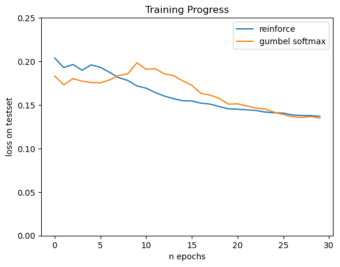
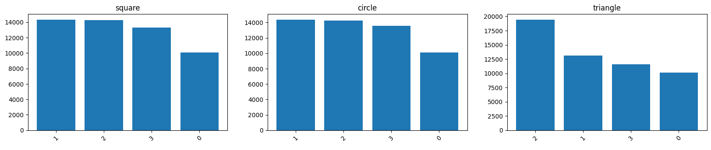
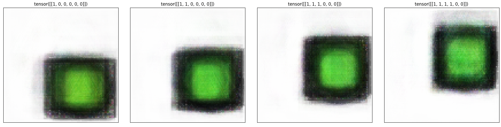

# Referential Language Game with Compositional Inputs

## Introduction & Motivation
The study of emergent languages in multi agent referential games can be used to gain insight into the emergence of natural languages. The idea comes from referential games [5]. In it's most basic version, two agents must jointly solve a task: A **sender** agent is presented with some input, for example an image. Based on this input, it generates a **message**. The message is send to a receiver agent, who has to perform an action (for example, point to the correct image among other distractor images). The message is composed of **discrete** symbols, mimicing natural language (i.e. words, as opposed to a continuos value). The networks are rewarded if the task is successful. After some training, a **communication protocol** has emergered. This communication protocol can be seen as an emergent language and analysed in terms of natural language's features, like compositionality, ability to generalise or learnability.

<figure role="group">
  
  <figcaption>
    Fig.1 The image on the left was presented to the sender. The sender, then, created the message [2, 1, 3, 3, 3, 0]. The receiver created the image on the right, based on this message.
  </figcaption>
</figure>

We designed and implemented a referential game where the sender agent sees images by means of a **Convolutional Neural Network** (CNN). The CNN serves as a feature extractor. The extracted features are then the input to a **Recurrent Neural Network** (RNN) which generates a message. This message is sent to a receiver who decodes it using another RNN. The output of this RNN is given to a **Fully Connected Feed Forward Network** that generates an image based on the input given.

## Methods: Referential Language Games with EGG
EGG (Emergence of lanGuage in Games) [3] is a toolkit developed by Facebook for implementing referential language games. The games can be divided into two categories (I) Discrimination, here the receiver agent has to choose the coorect image from a set of images that additionaly includes distractor images. (II) Reconstruction, in this version, which is implemented here, the task of the receiver is to recreate the original image.

We created a set of images where each image is of size 100x100 pixels and with three colour channels. The content of the images consist of: a shape, the shapes center in terms of x-coordinate and y-coordinate, the shape's size, color, and the existence of an outline. Each of these features is mapped onto the interval \[0, 1\]. The shape can be one of three categories (circle, square, triangle). For simplicity, the vector representation assumes an ordinal scaling and maps these three categories to the values 0, 0.5 and 1.0, respectively. This means one image is represented as a vector of size 6 with each element in the intervall \[0,1\]
This vector representation is used as targets, for pretraining a vision module for the sender agent. The vision module is a Convolutional Neural Network. After training, the final classification layer is left out and the models weights are kept fixed. That way a pretrained vision module serves as a feature extractor for the input images. The features contain all necessary information for the sender to describe the images. The abstract features, that the vision module extracts are sent to a linear layer, that maps them to the weights of the senders Recurrent Neural Network's (in our case a GRU) hidden layer's weights. The Vision module and the RNN are the sender agent. The GRU outputs a probability distribution over a given alphabet, for every element of the message, i.e. the message's length. The message is then send to the receiver. The receiver's RNN decodes. The decoded message servers then as input to the receivers fully connected feed forward network which has 3 * 100 * 100 output neurons (exactly the dimensions of the input image. The activation function of this output layer is the sigmoid function, which outputs values between 0 and 1. 

The training algorithm is another choice that EGG offers. Since the message consists, by definition, of discrete symbols, a method must be found to obtain a differentiable loss. This is achieved by using REINFORCE, i.e. sampling and using a categorical probability distribution to compute the log-probabilities of the output. A natural approach for doing this is interpreting the discrete symbols as a discrete action space of the sender agent. Therefore the sender agent can be trained with reinforcement learning. (It is also possible to do so with the receiver and interpret its output as probability distribution. This can make sense for categorical outputs like in the discrimination version of the task.)

Another way of training with strictly discrete outputs of the sender is using the gumbel softmax trick. Below, you can find a comparison of the outcome of the two approaches.

## Methods: REINFORCE in EGG
The term REINFORCE is used inconsistently in the literature. Accoring to [1], it is characterize by the **RE**ward **I**ncrement being constructed of a **N**onnegative **F**actor (learning rate), **O**ffset **R**einforcement (reward - baseline) and a **C**haracteristic **E**ligibility (probability of action). 

$\Delta w_{ij} = \alpha_{ij}(r-b_{ij})e_{ij}$

In other sources ([2]), a baseline is not nessecary. The implementation in EGG follows the first definition [3] and adapts it to a referential language game scenario. That implies offline learning, since updates can only be done after a complete message was sampled after completing an episode. An extension with actor-critics is not possible in an offline learning scenario [2].

The baseline that EGG uses is the average of all previously recored rewards. In [4] this is (in cases like this) proven to converge to the optimal baseline that most reduces variance.

## Implementation

The training of the game can be found in `main.py` and an exemple evaluation in `evaluation.ipynb`. Pretrained models can be loaded from `/models`. The data for the training and testing during training can be found in `/data/continuous` and additional testing data used in the evaluation in `/data/eval`. For the usage of the individual classes and functions, please refer to the docstrings.

During training and after each epoch a backup of the whole `LanguageGame` instance is saved in `default.pth`.

## Results

For an in depth evaluation, please refer to `evaluation.ipynb`.

<figure role="group">
  
  <figcaption>
    Fig. 2: Test loss of two games during traing. Both games seem to converge at a loss of 0.15 after 30 epochs.
  </figcaption>
</figure>

<figure role="group">
  
  <figcaption>
    Fig. 3: 1-gram. "1" was the most used symbol in communications about squares and circles. For triangles it was "2". For more complex n-grams, please refer to evaluation.ibynb.
  </figcaption>
</figure>

<figure role="group">
  
  <figcaption>
    Fig. 4: Artificial messages can be a way of assessing the semantics of individual symbols/symbol positions.
  </figcaption>
</figure>

## Refs

[1] Williams, R. J. (1992). Simple statistical gradient-following algorithms for connectionist reinforcement learning. Machine learning, 8(3), 229-256., https://doi.org/10.1007/BF00992696

[2] Sutton, R.S., & Barto, A.G. (2005). Reinforcement Learning: An Introduction. IEEE Transactions on Neural Networks, 16, 285-286.

[3] Kharitonov, E., Chaabouni, R., Bouchacourt, D., & Baroni, M. (2019). EGG: a toolkit for research on Emergence of lanGuage in Games. EMNLP.

[4] Weaver, L., & Tao, N. (2013). The optimal reward baseline for gradient-based reinforcement learning. arXiv preprint arXiv:1301.2315.

[5] David Lewis. Convention: A philosophical study. 1969
